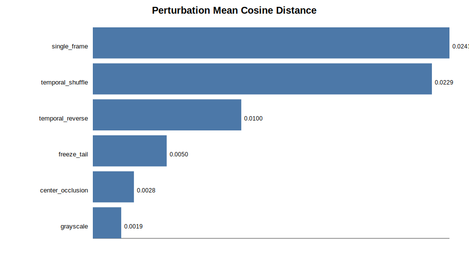
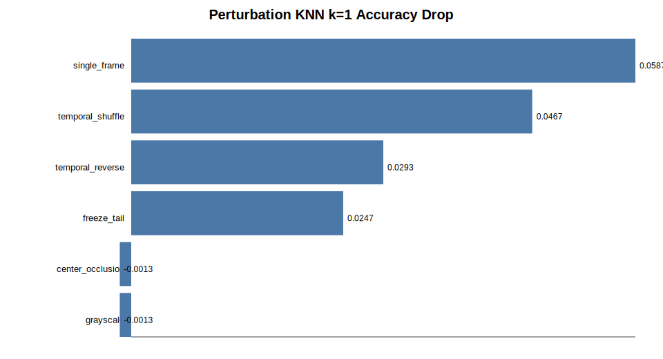

# VRL

Motion / appearance sensitivity analysis for pretrained video models. The current experiment evaluates frozen `MCG-NJU/videomae-base` embeddings on a balanced Something-Something-V2 subset.

## Current Experiment

| Field | Setting |
| --- | --- |
| Dataset | Balanced 50-class SSV2 subset |
| Data scale | 5,000 train videos (100/class); 1,500 validation videos (30/class) |
| Class coverage | Both splits contain the same 50 classes |
| Model | `MCG-NJU/videomae-base`, frozen encoder, no fine-tuning |
| Input and embedding | 16-frame deterministic center clip; 768-d mean-pooled `last_hidden_state` |
| Evaluation | Original train embeddings are the KNN reference; only validation queries are perturbed |

## Main Results

The original KNN baseline reaches cosine accuracy of `8.40%` at `k=1`, `9.93%` at `k=5`, and `11.00%` at `k=10`; L2 results are similar. This is a frozen-representation diagnostic, not fine-tuned action-recognition performance.

Motion perturbations have a mean cosine embedding distance of **0.015482**, versus **0.002344** for appearance perturbations: a difference of about **6.6×**. With cosine KNN at `k=1`, the mean motion-group accuracy drop is **0.039833**, while the appearance-group value is **-0.001333**. Motion perturbations also have a higher mean prediction-change rate (**0.732667** vs. **0.456333**).

| perturbation | group | mean cosine distance | k=1 accuracy drop | prediction-change rate |
| --- | --- | ---: | ---: | ---: |
| `single_frame` | motion | 0.024057 | 0.0587 | 0.8973 |
| `temporal_shuffle` | motion | 0.022874 | 0.0467 | 0.8207 |
| `temporal_reverse` | motion | 0.010014 | 0.0293 | 0.5760 |
| `freeze_tail` | motion | 0.004984 | 0.0247 | 0.6367 |
| `center_occlusion` | appearance | 0.002773 | -0.0013 | 0.5567 |
| `grayscale` | appearance | 0.001916 | -0.0013 | 0.3560 |

`single_frame` and `temporal_shuffle` are the strongest temporal probes. Earlier `freeze_tail` disruption causes larger embedding shifts and KNN drops; larger `center_occlusion` causes larger embedding shifts. Temporal-shuffle results are similar across three seeds.





## Interpretation and Limitations

The results support the claim that frozen VideoMAE embeddings substantially use temporal information in this SSV2 setting. They do not prove complete action understanding: motion perturbations also alter temporal redundancy and video naturalness, while center occlusion can hide hands, objects, and local motion evidence.

The experiment covers one model, one motion-oriented dataset, and six coarse perturbations. Next steps include more controlled appearance and motion probes, confidence intervals or statistical tests, appearance-biased datasets, and linear-probe or fine-tuned controls.

## Reproduction

```bash
uv sync --dev
uv run python -m pytest
uv run python -m src.reporting \
  --log-dir outputs/logs \
  --report-dir outputs/reports \
  --plot-dir outputs/plots
```

Embedding artifacts are stored in `outputs/embeddings/`, metrics and summaries in `outputs/logs/`, and tables and plots in `outputs/reports/` and `outputs/plots/`.
